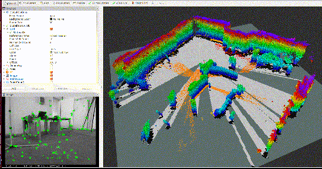

# ORB-SLAM2 ROS版稠密地图构建

基于[ORB_SLAM2_RGBD_DENSE_MAP](https://github.com/tiantiandabaojian/ORB-SLAM2_RGBD_DENSE_MAP)点云地图构建工作修改, 感谢各位大佬的分享, 还在完善中...



## 1. 更新记录

- v0.2.1-2019/11/14: 修复Eigen固定维度数组内存对齐问题

- v0.2.0-2019/11/09: 添加对平面移动机器人建图的支持, 分割并去除地面, 构建栅格地图

- v0.1.0-2019/11/01: 上传ORB-SLAM2 ROS版稠密重建工程, catkin编译, 发布必要的消息

## 2. 添加功能

- 修改了原始[ORB-SLAM2](https://github.com/raulmur/ORB_SLAM2)不太友好的rosbuild编译方式

- 发布ORB-SLAM2必要的消息, 重建点云地图, 可以使用[octomap_server](http://wiki.ros.org/octomap_server)转换成八叉树地图

- 添加了对平面移动机器人建图的支持, 使用[octomap_server](http://wiki.ros.org/octomap_server)将八叉树地图投影为栅格地图

- 添加地面分割去除的功能(仅平面移动机器人, 且视角中能看到大部分地面有效), 允许建图时每次对整个地图地面分割, 或者每一个关键帧都做地面分割(推荐), 利用地面法向量对地图坐标系进行校正

## 3. 使用

将工程放在ROS工作空间中

```bash
cd ~/catkin_ws/src/ORB-SLAM2_DENSE/
```

添加词典txt文件到`./Vocabulary`, 编译ORB-SLAM2库:

```bash
chmod +x build.sh
./build.sh
```

编译ROS功能包:

```bash
cd ~/catkin_ws/
catkin_make
```

修改launch文件中涉及的路径, 运行launch文件:

```bash
roslaunch orb_slam2_dense tum_pioneer.launch
```

## 4. 注意事项

除了ORB-SLAM2编译的注意事项之外, 还有一些额外的注意点:

- 需要根据自己的环境修改`CMakeList.txt`, 比如PCL库的路径: [ORB-SLAM2中](./CMakeLists.txt#L48), 和[ROS功能包中](./Examples/ROS/ORB_SLAM2_DENSE/CMakeLists.txt#L64)

- 编译后`orb_slam2_dense`功能包因为路径的原因无法找到, 但是命令是可以正常运行的

- 如果需要启用平面分割功能, 在yaml配置文件中`PointCloudMapping::PlaneSegmentation::UsePlaneSegmentation`请设置为`1`, 如果要启用逐关键帧地面分割去除的功能, 在启用地面分割的基础上, `PointCloudMapping::PlaneSegmentation::SegmentPerFrame`请设置为`1`

## 5. 存在问题

- Rviz中点云类型`sensor_msgs::PointCloud2`不能正常显示, `sensor_msgs::PointCloud`可以, 但是颜色不对

- 编译完成后用`rospack`找不到`orb_slam2_dense`功能包, 但是`rosrun`和`roslaunch`都能正常工作
